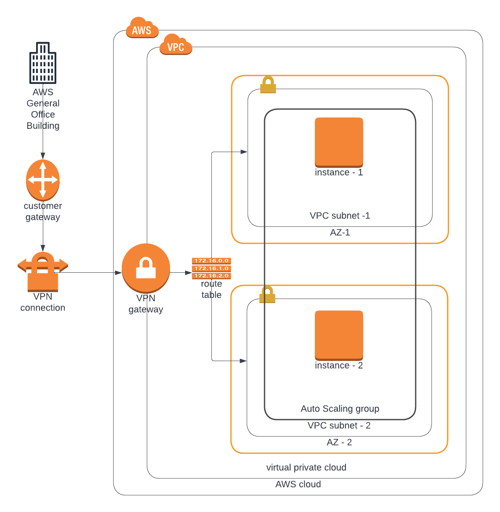

## AWS Infrastructure as Code - On-premise application
This architecture is use to provision cloud resourses for on-premise application

### Forders/Files
1. paramters files- Creating aws IAC parameter for the provision resources
2. server file - Provisioning of servers use such VMS, Autoscalling ...
3. Netwrok file - Provision of networks for the applictaion
4. create.sh & Update.sh - simplified script file for aws cloudformation for creating and updating.

### Corperate Network Diagram


### Dependencies
##### 1. AWS account
You would require to have an AWS account to be able to build cloud infrastructure.

##### 2. VS code editor
An editor would be helpful to visualize the image as well as code. Download the VS Code editor [here](https://code.visualstudio.com/download).

##### 3. An account on www.lucidchart.com
A free user-account on [www.lucidchart.com](www.lucidchart.com) is required to be able to draw the web app architecture diagrams for AWS.


### How to run the supporting material?
You can run the supporting material in two easy steps:
```bash
# Ensure that the AWS CLI is configured before runniing the command below
# Create the network infrastructure
# Check the region in the create.sh file
./create.sh myFirstStack network.yml network-parameters.json
# Create servers
# Change the AMI ID and key-pair name in the servers.yml
# Check the region in the update.sh file
./update.sh mySecStack servers.yml server-parameters.json
```


### Sample Commands for creating aws cloudformation is found [here](./commands/README.md) 
